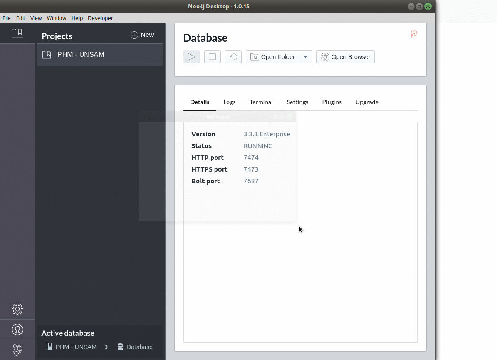
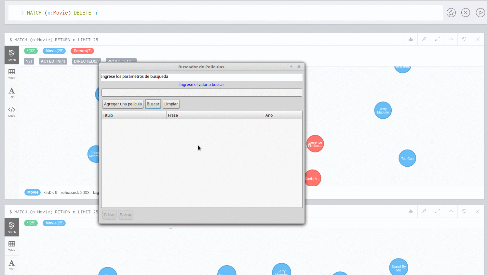
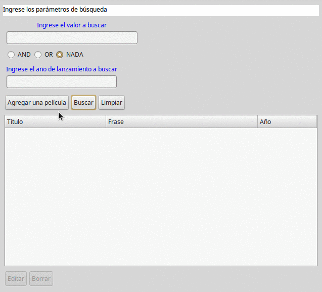
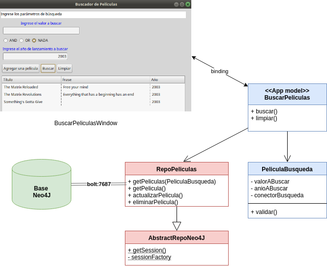

# Películas - Proyecto Xtend contra una base Neo4J

[](https://travis-ci.org/uqbar-project/eg-peliculas-neo4j)

## Objetivo
Mostrar la integración entre una app hecha en JDK, Neo4J y el framework OGM.

Toma la base de películas de ejemplo que viene con Neo4J y permite 

* generar una película nueva
* buscar películas existentes y editarlas
* agregar personajes
* a futuro, permitirá la actualización de actores

## Modelo Neo4J
Existen nodos Movie (Película) y Person (que representan cada Actor), que tienen una relación
ACTED_IN con atributos roles que terminan trasladándose al modelo de objetos como una clase Personaje.

## Cómo ejecutar el ejemplo

* Instalar la última versión de Neo4j en https://neo4j.com/download/
* Ir a la carpeta bin del directorio de instalación de Neo4J. Levantar el server desde el Neo4J Desktop, por el servicio o bien por línea de comando: 

```
$ ./neo4j start
```

* Abrir el Navegador de Neo4J Desktop o bien ingresar manualmente a la URL: http://localhost:7474
* Ejecutar el script que carga el grafo de películas (viene como ejemplo)



* En el Eclipse, ingresar al archivo AbstractRepoNeo4J y verificar la configuración

``` Xtend
	Configuration configuration = new Configuration.Builder().uri("bolt://localhost").credentials("neo4j", "laura").
		build()

	SessionFactory sessionFactory = new SessionFactory(configuration, "ar.edu.peliculasNeo4J.domain")
```

En este caso estamos utilizando el puerto por defecto que es el 7687 (en caso de utilizar otro podemos especificarlo, por ejemplo "bolt://localhost:11002"), el driver bolt (que recomendamos ya que es bastante liviano), y conectándonos como administradores de la base a neo4j y con contraseña "laura" (la que viene por defecto es neo4j pero a veces el Neo4J Desktop te obliga a cambiarla).

El objeto que crea las sesiones de Neo4J para hacer las consultas precisa saber el paquete de Java donde están las clases del dominio (en nuestro caso es "ar.edu.peliculasNeo4J.domain", estén atentos a mayúsculas y minúsculas porque es case-sensitive, de lo contrario les aparecerá un nefasto NullPointerException).

* Botón derecho sobre el archivo "Peliculas Neo4J.launch" y Run, si respetaste el nombre del proyecto: eg-peliculas-neo4j



Como vemos, las modificaciones que hagas impactarán en el grafo de películas.


> Una ventaja comparativa respecto a la conexión con el Driver nativo de Neo4J es que aquí podés navegar el grafo y utilizar la aplicación sin necesidad de cerrar una ventana u otra

## Mejoras de la última versión

- Ahora existe un método getSession() en AbstractRepoNeo4J para encapsular la instanciación de la sesión de Neo4J. Ese método lo aprovechan las subclases RepoActores y RepoPeliculas que hacen las búsquedas y actualizaciones.

- El sessionFactory es único en toda la aplicación, así que es una variable static en AbstractRepoNeo4J.

- La búsqueda ya no es en profundidad infinita, sino que considera: 0 para la búsqueda de lista (solamente el nodo, sin las relaciones) y 1 para la búsqueda puntual de una película (el nodo y sus relaciones directas, hasta ahí). Hay dos nuevas constantes en AbstractRepoNeo4J, lo que permite que la bajada de disco a memoria sea más performante.

- Agregamos una búsqueda por año de lanzamiento de la película y un RadioSelector para conectar mediante OR o AND. Eso permite buscar por más de un criterio. Aparece una nueva abstracción PeliculaBusqueda que tiene validaciones, y es usado por el Repo de búsqueda de películas, que ahora construye un objeto [Filters](https://neo4j.com/docs/ogm-manual/current/reference/#reference:filters), que permite hacer búsquedas por más de un criterio. Lo único malo es que hay que devolver siempre un Filters compuesto, entonces se creó un filtro "que no filtra" para poder incorporarlo cuando solo haya un criterio de búsqueda.
 
- La búsqueda por título de la película es case insensitive ahora, porque se modificó la expresión regular para que no considere mayúsculas y minúsculas: `"(?i)"`


 

## Diagrama general de la solución


